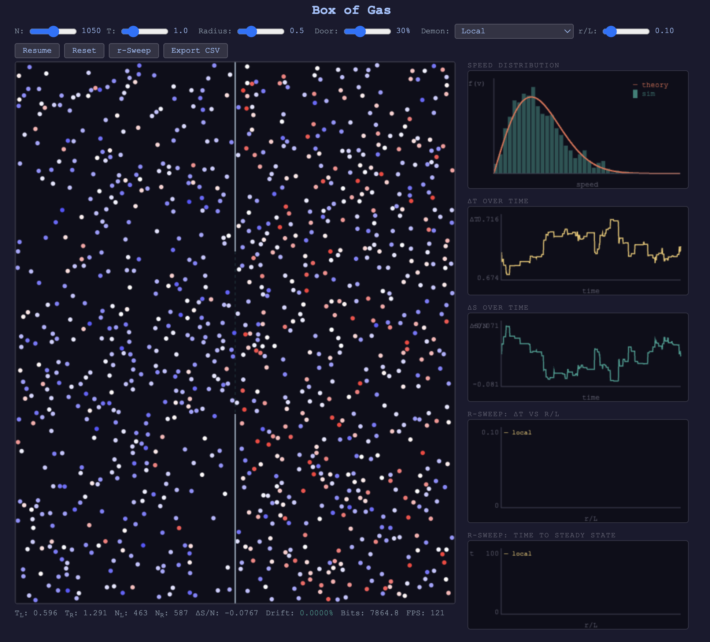

# Box of Gas — Centralized vs. Decentralized Control Simulator

A 2D particle simulation exploring how much of Maxwell's Demon sorting power can be recovered using only local information. Particles in a box follow Maxwell-Boltzmann statistics with elastic collisions. A partition with a door divides the box, and different "demon" policies control which particles pass through. Crossings use a **paired-swap rule** (one left + one right candidate swap simultaneously) so $\Delta N_L = \Delta N_R = 0$ at all times and the steady-state $\Delta T$ is well-defined.

The core question: **how much of the demon's sorting power can be recovered using only local information?**

**TL;DR (5 seeds, N = 2000):** the optimal ("god") demon reaches $\Delta T = 0.96 \pm 0.03$ — the greedy-optimal upper bound. A local demon polling just 9% of the box width ($r/L = 0.09$) recovers 95% of the classical adaptive demon and 90% of god, at less than half the information budget. See [REPORT.md](REPORT.md) for the full write-up.



## Headline Plots

ΔT vs neighborhood radius — god demon sets the ceiling, local catches up fast:


Information cost grows steeply with r; most of the sorting is already won at small r:


Centralization ↔ information ↔ sorting trade-off (color = bits/sim-s):


Entropy signature — larger ΔT pairs with more negative ΔS/N, as expected:


## How to Run

Serve the directory with any static HTTP server, then open `index.html`:

```bash
python3 -m http.server        # then visit http://localhost:8000
```

No build step, no npm, no dependencies — just vanilla JS files loaded via `<script src>`.

## Python Analysis Package (uv-ready)

You can analyze CSV exports offline using the bundled Python CLI:

```bash
cd box_of_gas
uv run box-of-gas-analyze path/to/export.csv --out plots/
```

The CLI depends only on `matplotlib` and is packaged via `pyproject.toml` so you can `uv tool install .` or run it directly with `uv run`.

## Automated Experiments

Use `experiments.py` to drive the in-browser simulator headlessly via Playwright, run multiple r-sweeps, download each CSV, and optionally regenerate the analysis plots:

```bash
cd box_of_gas
uv run playwright install chromium    # first time only
uv run python experiments.py --particles 2000 --out experiments_out
```

The script defaults to eight consecutive seeds (1000-1007) and a 3600 s sweep timeout. Command-line options let you control particle count, temperature, radius, door width, seed range, and whether plots are generated. Pass `--seed <value>` to run a single explicit sweep (it overrides `--seeds`/`--seed-base`). Outputs include timestamped CSV/plot folders plus a JSON summary with per-run stats.

### Updating Report Assets

After running a batch of experiments, regenerate the figures used by `REPORT.md` / `report.docx` directly from the latest summary:

```bash
cd box_of_gas
uv run python build_report_plots.py --summary experiments_out/experiments_summary_YYYYMMDDTHHMMSSZ.json
```

If `--summary` is omitted, the script picks the newest summary in `experiments_out/`. The resulting PNGs land in `report_plots/`.

## Concept

### Four Regimes

1. **No demon (control):** Door is open, particles pass freely. Both sides equilibrate to the same temperature.
2. **Classical Maxwell's demon (adaptive):** Uses the mean speed of all particles on the arriving side (excluding the arriving particle). This is our global-information benchmark — the same mean-based rule as the local demon, but with a complete sample.
3. **Optimal ("god") demon:** Enforces the paired-swap rule with a shared energy threshold $\theta = \dfrac{T_R/N_R + T_L/N_L}{1/N_R + 1/N_L}$. Left arrivals queue only if their kinetic energy exceeds $\theta$; right arrivals queue only if it falls below $\theta$. That guarantees every swap moves energy in the correct direction.
4. **Local "swarm" demon:** Each particle, upon arriving at the door, polls same-side neighbors within radius `r`, compares its speed to the local average, and decides whether to cross. As `r` grows to include the entire box, this approaches the adaptive classical demon's behavior.

### The r-Sweep Comparison

The automated **r-sweep** runs all four regimes from identical initial conditions and produces:

- **ΔT vs r/L**: sorting quality as a function of neighborhood radius. Shows a steep rise where most sorting power is recovered well before `r = L`.
- **Time to steady state vs r/L**: how quickly each regime converges.
- **Adaptive and god baselines** drawn as horizontal reference lines. Under paired swaps the god demon ($\Delta T \approx 0.96$) consistently sits above adaptive ($\Delta T \approx 0.91$); the local demon plateaus between them and matches adaptive exactly once $r/L \gtrsim 0.86$.

## Design Decisions

### Physics

- **2D hard-sphere simulation** with N particles (default N = 2000).
- **Dimensionless units:** k_B = 1, m = 1, box size 100 x 100.
- **Time-stepping approach** (not event-driven) with fixed dt.
  - dt constraint: dt < 0.2 x R / (3 sqrt(T/m)) to keep overlaps rare.
  - Overlap resolution: separate to exactly touching along line of centers, then apply elastic impulse.
- **Energy conservation monitor**: drift displayed live, color-coded warning at 0.1%.
- **Velocities initialized** from Maxwell-Boltzmann via Box-Muller. Net momentum removed.
- **Collision detection** via cell lists (spatial hash). O(N) per frame.
- **Wall collisions:** elastic reflection (flip relevant velocity component).

### Partition and Door

- **Partition** is a vertical line at x = L/2.
- **Door** is a segment of the partition with variable width W (set as a fraction of box height).
- **Geometric trigger:** particle overlapping the door segment triggers the policy decision.
- **Rejection:** particle reflects elastically off the partition.
- **Decision timing:** arrival-only.
- **Paired swaps:** accepted particles park at the door, and the demon swaps one left and one right candidate simultaneously. That enforces $\Delta N_L = \Delta N_R = 0$ and prevents runaway imbalance.

### Classical Demon Policy

- **Adaptive threshold:** mean speed of all particles on the arriving side, excluding the arriving particle. Ongoing global knowledge. Both mean-based demons (adaptive and local) use the same reference population and answer the same question — the classical demon just has a perfect sample (no radius limit). Accepted particles wait in a door queue until the opposite queue also has a candidate so the swap keeps both chambers' counts unchanged.

### Local Demon Policy

When particle `i` arrives at the door from side S:

1. Find all particles `j` where:
   - `j` is on side S (same-side only — the partition is an information barrier)
   - distance(i, j) <= r
   - j != i
2. Compute mean speed |v| of that neighbor set.
3. If |v_i| > mean -> pass through.
4. If |v_i| <= mean -> reject (reflect).
5. **If the neighbor set is empty -> reject.** No information = no basis for a decision.

**Bidirectional rule:** particles can cross in both directions. A slow particle on the right can decide to cross left.

**Paired swaps:** once a particle clears the rule above it parks at the partition until the opposite side produces a partner. The demon then swaps that pair simultaneously, keeping $N_L$ and $N_R$ constant.

### Measurements

Tracked over time:

- **dT = T_right - T_left:** primary order parameter.
- **dS per particle:** 2D ideal gas entropy change, S = N[ln(A/N) + ln(T)].
- **Cumulative information bits:** classical = log2(N) per decision, local = log2(k+1) where k = neighbors polled.

**Steady-state detection:** compares dT now vs 30 sim-seconds ago. Two independent criteria (either triggers):

- **Relative:** change < 2% of peak |dT| (only when peak > 0).
- **Absolute:** peak |dT| is tiny (< 5x threshold), current |dT| < 0.005, and change < 0.005.

Minimum sim time of 100 before checking. During sweeps, an additional **hold period** of 40 sim-seconds after detection confirms stability, plus minimum run times (400 for baselines, 200 for local).

### r-Sweep

The automated sweep:

1. Initializes particles once and saves state (positions, velocities, and swap-queue state).
2. Runs classical (adaptive) from saved state to convergence.
3. Runs optimal (god) from saved state to convergence.
4. Sweeps 15 values of r/L from 0.02 to 1.0, each from the same saved state.
5. Plots dT and time-to-steady vs r/L with both baselines as horizontal reference lines.

All runs share identical initial conditions, so differences are purely due to the demon policy. Typical outcome: god consistently beats adaptive by ~5.5%; local reaches 95% of adaptive at $r/L = 0.09$ and matches it exactly once the sensing radius covers the full half-box.

### Technology

- **Vanilla JS + HTML5 Canvas.** No build step, no npm, no frameworks.
- Canvas rendering for particles (blue -> red by speed) and partition/door.
- Live plots: speed distribution (vs MB theory), dT(t), dS(t), sweep results.

### File Structure

| File | Lines | Responsibility |
| ---- | ----- | -------------- |
| `index.html` | ~280 | HTML/CSS, controls, main loop, sweep termination logic |
| `sim.js` | ~370 | Physics engine: init, collisions, walls, paired-swap queues, steady-state detection |
| `policy.js` | ~80 | Demon door policies (none, classical-adaptive, god, local) |
| `render.js` | ~300 | All canvas rendering, FPS tracking, stats bar |
| `sweep.js` | ~230 | r-sweep orchestration, state save/restore (incl. swap queues), CSV export |

All files use classic `<script src>` tags (not ES modules) so they share the global scope. Load order: sim → policy → render → sweep → inline controls.

### UI

- **Left panel:** particle canvas with colored particles and visible partition/door.
- **Right panel:** speed distribution histogram, dT over time, dS over time, dT vs r/L sweep chart, time-to-steady sweep chart.
- **Top bar:** sliders for N, T, particle radius, door width, demon type dropdown, r/L slider (when local selected). Buttons: Start/Pause, Reset, r-Sweep, Export CSV.
- **Bottom bar:** T_left, T_right, N_left, N_right, dS, energy drift, cumulative bits, FPS, sim time, steady-state indicator.
- **CSV export:** downloads time series and sweep results including the adaptive baseline.
