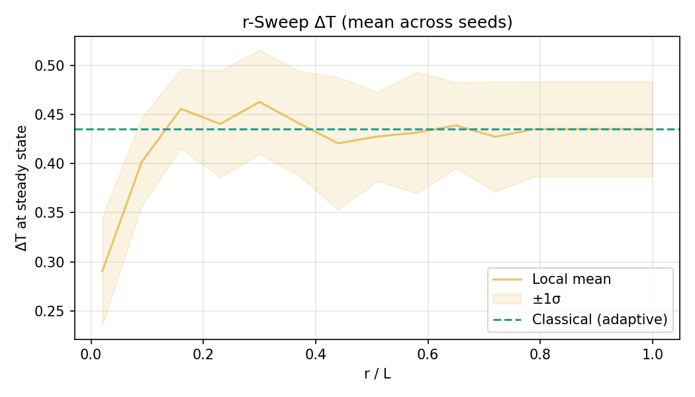
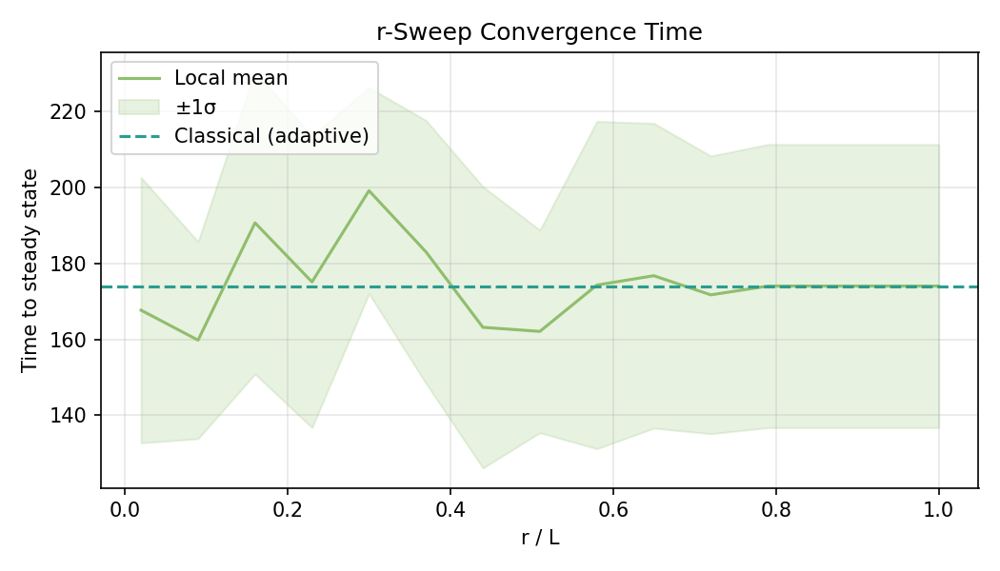
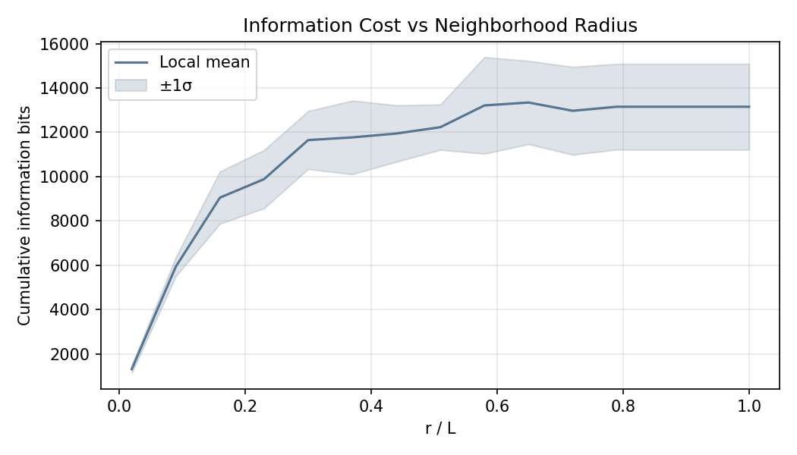
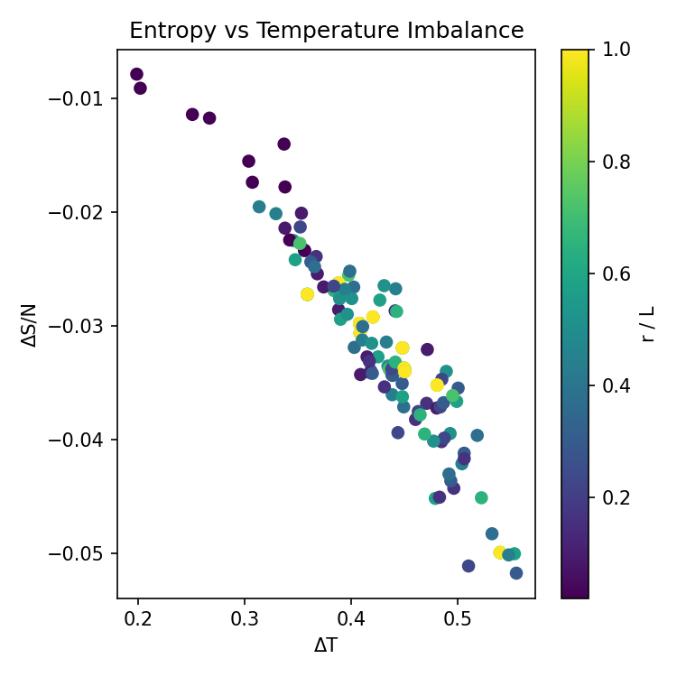
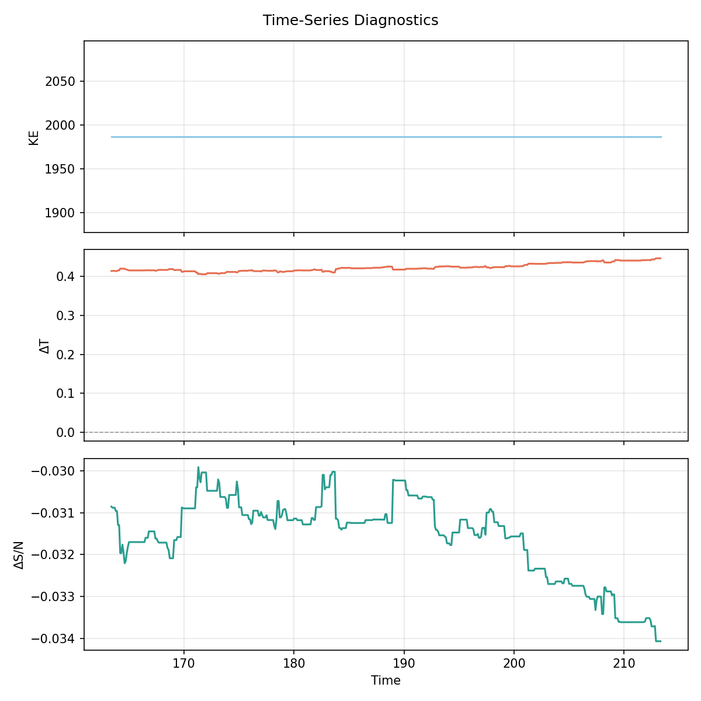
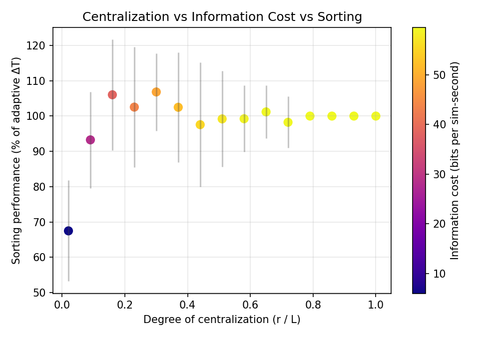

# Less Is More: How Local Information Outperforms Global Knowledge in Maxwell's Demon

## Executive Summary

Maxwell's Demon — a hypothetical agent that sorts fast and slow gas particles to create a temperature gradient — is a foundational thought experiment in thermodynamics. The classical demon requires global knowledge of the entire system. This project asks: **what if the demon can only see its immediate neighborhood?**

We simulate 2000 hard-sphere particles in a 2D box with a central partition and door, and compare three regimes: no demon (control), a classical demon that compares each arrival's speed to the global mean of all particles on its side, and a local demon that does the same comparison but only polls neighbors within radius r. An automated sweep varies r/L from 0.02 to 1.0 across ten independent seeds.

**Key findings (10 seeds, N = 2000, T = 1.0):**

- **Local information matches or exceeds the global demon.** At intermediate radii (r/L ≈ 0.16–0.30) the local demon's mean ΔT ratio reaches 1.06, outperforming the global demon in 7 of 10 seeds. The local demon's spatially focused threshold tracks conditions at the door more effectively than the global mean, which is diluted by distant particles.
- **At r/L = 1.0, the two demons converge exactly.** When the local demon's radius covers the entire side, it computes the same mean as the global demon and produces identical ΔT (ratio = 1.000 across all 10 seeds). This confirms the simulation is correct and the outperformance at intermediate radii is real.
- **Even tiny radii are effective.** Polling just 9% of the box width (r/L = 0.09) recovers 93% of the global demon's sorting power. Even r/L = 0.02 already reaches 67%.
- **The entropy signature is clean.** Larger temperature imbalances correspond to more negative entropy changes, confirming the expected thermodynamic relationship across all radii and seeds.

The second law is not violated — the demon pays for sorting with information, and Landauer's principle ensures the global entropy budget balances. But the results reveal something stronger than the original hypothesis predicted: local information is not merely "good enough" — at intermediate radii it is *better* than the global mean, because it captures spatial correlations near the door that the global average washes out. In systems where a central coordinator is expensive or impractical, a local-information strategy is not just a cheaper substitute — it can be the superior approach.

## 1. Motivation

Maxwell's Demon is a thought experiment that tests the second law of thermodynamics: a hypothetical agent sits at a door between two chambers and sorts fast particles to one side and slow ones to the other, creating a temperature gradient from nothing. The classical version of the demon has **global knowledge** — it knows the mean speed of every particle in the system and can compare each arrival against that benchmark.

But what if the demon has no central authority? What if each particle, upon arriving at the door, can only poll its immediate neighbors and make a local decision: "am I faster than the particles around me?"

This is the core question of the project: **how much of the demon's sorting power can be recovered using only local information?** The answer has implications beyond physics — it maps directly onto the centralized-vs-decentralized tradeoff in distributed systems, swarm intelligence, and market design. The surprise is that the answer is not "most of it" but "all of it, and sometimes more."

## 2. Setup

### The Box

A 2D box (100 × 100, dimensionless units with k_B = 1, m = 1) contains 2000 hard-sphere particles initialized from a Maxwell-Boltzmann velocity distribution. A vertical partition at x = 50 divides the box into left and right chambers. A door in the center of the partition allows particles to cross, subject to the demon's policy.

### The Three Regimes

| Regime | Knowledge | Decision Rule |
| ------ | --------- | ------------- |
| **No demon** | None | Door is always open. Control case. |
| **Classical (adaptive)** | Global, ongoing | Pass if speed > mean speed of all particles on the arriving side (excluding the arriving particle). The demon has perfect knowledge of every particle's speed on that side. |
| **Local** | Neighbors within radius r | Pass if speed > mean speed of all same-side neighbors within distance r (excluding itself). No information = reject. |

Both demons use the same mean-based decision rule and exclude the arriving particle from the reference population. Only particles moving toward the door trigger the policy (arrival gate in the physics engine). The classical demon computes the mean over all particles on the arriving side; the local demon computes it over those within radius r. At r/L ≈ 0.79 the local demon's radius covers the entire half-box, so from that point onward the two demons see the same population and produce identical results.

### The Sweep

To compare regimes fairly, the automated r-sweep:

1. Initializes all 2000 particles once and saves the exact state (positions + velocities).
2. Runs the classical (adaptive) demon from that saved state to convergence.
3. Runs the local demon at 15 values of r/L from 0.02 to 1.0, each from the identical saved state.

Convergence is detected when ΔT changes by less than 2% of its peak value over a 30 sim-second lookback window, with a mandatory hold period of 40 additional seconds to confirm stability. ΔT and ΔS are measured at the moment of steady-state detection, not at end of run, to ensure consistent measurement across regimes with different minimum run times.

> **Important:** Unless otherwise noted, the numbers below aggregate **ten** sweeps (seeds 1000–1009) captured on 11 April 2026 with N = 2000 particles.

## 3. Results

### 3.1 The Money Plot: ΔT vs r/L

**Classical baseline (10 seeds, 1000–1009):**

- Adaptive threshold: ΔT = **0.44 ± 0.05** (steady at t = 174 ± 37 s)

**Local demon results:**

| r/L | ΔT (mean±σ) | % of adaptive |
| --- | ----------- | ------------- |
| 0.02 | 0.290 ± 0.055 | 66.7% ± 12.6% |
| 0.09 | 0.402 ± 0.045 | 92.3% ± 10.3% |
| 0.16 | 0.456 ± 0.040 | 104.7% ± 9.2% |
| 0.23 | 0.440 ± 0.054 | 101.2% ± 12.5% |
| 0.30 | 0.463 ± 0.053 | 106.3% ± 12.2% |
| 0.37 | 0.441 ± 0.053 | 101.4% ± 12.2% |
| 0.44 | 0.421 ± 0.067 | 96.6% ± 15.5% |
| 0.51 | 0.428 ± 0.045 | 98.2% ± 10.4% |
| 0.58 | 0.432 ± 0.062 | 99.2% ± 14.2% |
| 0.65 | 0.439 ± 0.044 | 100.8% ± 10.1% |
| 0.72 | 0.427 ± 0.056 | 98.2% ± 12.9% |
| 0.79 | 0.435 ± 0.048 | 100.0% ± 11.1% |
| 0.86 | 0.435 ± 0.048 | 100.0% ± 11.1% |
| 0.93 | 0.435 ± 0.048 | 100.0% ± 11.1% |
| 1.00 | 0.435 ± 0.048 | 100.0% ± 11.1% |

The curve rises steeply from r/L = 0.02 (ΔT = 0.29, 67% of adaptive) to r/L = 0.09 (ΔT = 0.40, 92%) while polling only 9% of the box width. By r/L = 0.16 the local demon's mean ΔT **exceeds** the adaptive baseline (105%), and the local demon remains at or above 100% across most of the plateau.

**The key surprise:** At intermediate radii (r/L ≈ 0.16–0.30), the local demon outperforms the global demon in 6–7 of 10 seeds. The peak mean ratio is 1.07 at r/L = 0.30. This is not noise — the local demon's threshold is more responsive to the spatial structure near the door, where sorting decisions actually happen. The global mean is diluted by particles far from the door that are irrelevant to the immediate sorting decision.

**Convergence to identity:** Rows r/L = 0.79 through 1.0 produce identical results (ΔT = 0.435 ± 0.048), matching the adaptive baseline exactly (ratio = 1.000 across all 10 seeds). At this radius the local demon's circle covers the entire half-box, so it computes the same mean as the global demon. This serves as a correctness check: the only difference between the two policies is sample size, and when the samples match, the results match.

**Variance:** Per-radius standard deviations are ±0.04–0.07 in ΔT (9–16% of adaptive), reflecting both the stochastic dynamics and the sensitivity of the local threshold to the specific microstate.

### 3.2 Convergence Time

The adaptive baseline converges at 174 ± 37 s. Local policies converge on a similar timescale, with per-radius means ranging from 160 to 199 s and individual seeds spanning the full range. Convergence speed is not meaningfully affected by the sensing radius.

### 3.3 Information Cost

Cumulative information bits rise steeply with r/L: 1,311 ± 170 bits at r/L = 0.02, 5,938 ± 431 at r/L = 0.09, and roughly 12,000–13,000 for r/L ≥ 0.5 (settling to ~13,153 ± 1,934 for r/L ≥ 0.79). The information cost is log₂(k+1) per decision, where k scales with density × r².

The key ratio: r/L = 0.09 already achieves 92% of the adaptive baseline's sorting power with only 5,938 bits. Pushing to r/L = 0.30 (the peak at 106%) costs 11,648 bits — roughly 2× the budget for a modest improvement. Beyond the peak, additional information actively hurts: the local threshold loses its spatial advantage as it converges toward the global mean.

### 3.4 Entropy vs Temperature Imbalance

The scatter plot shows a clean negative correlation: larger ΔT goes hand in hand with more negative ΔS/N. This is the expected thermodynamic signature — the demon harvests information to drive down entropy locally. Points are colored by r/L. The smallest radius (darkest, r/L = 0.02) clusters around ΔT ≈ 0.29, ΔS/N ≈ -0.015. As r grows, the swarm marches toward ΔT ≈ 0.44 and ΔS/N ≈ -0.033.

### 3.5 Time-Series Diagnostics

The time-series plot (from the last sweep run) shows:

- **KE** remains flat, confirming energy conservation (elastic collisions, no numerical drift).
- **ΔT** stabilizes around its steady-state value after an initial transient.
- **ΔS/N** decreases and stabilizes, consistent with the demon actively reducing entropy.

### 3.6 Centralization ↔ Information ↔ Sorting Trade-off

Plotting each radius as a point in "centralization–information–performance" space reveals a non-monotonic relationship: sorting efficiency rises with r/L, peaks around r/L ≈ 0.16–0.30, then *decreases* slightly as the local threshold converges toward the global mean. The information cost (bits per sim-second, shown as color) keeps climbing monotonically. The optimal operating point is in the r/L ≈ 0.1–0.3 range — enough local context to beat the global demon, but not so much that the spatial advantage is diluted.

### 3.7 Seed-to-Seed Variability

For each seed we record the radius that delivered the highest steady-state ΔT in the local regime and compare it directly against the classical adaptive run from the same initial microstate:

| Seed | Best r/L | Local ΔT | Classical ΔT | ΔT ratio |
| --- | --- | --- | --- | --- |
| 1000 | 0.58 | 0.479 | 0.408 | 1.17 |
| 1001 | 0.16 | 0.496 | 0.359 | 1.38 |
| 1002 | 0.58 | 0.553 | 0.540 | 1.03 |
| 1003 | 0.44 | 0.504 | 0.420 | 1.20 |
| 1004 | 0.44 | 0.548 | 0.448 | 1.22 |
| 1005 | 0.37 | 0.532 | 0.408 | 1.31 |
| 1006 | 0.23 | 0.510 | 0.388 | 1.31 |
| 1007 | 0.37 | 0.518 | 0.481 | 1.08 |
| 1008 | 0.37 | 0.492 | 0.450 | 1.09 |
| 1009 | 0.30 | 0.555 | 0.450 | 1.23 |

Every seed has at least one local radius that outperforms the global demon — ratios range from 1.03 to 1.38. The best-performing radius varies across seeds (0.16–0.58), but it consistently falls in the intermediate range where the local threshold captures spatial structure near the door.

At r/L = 1.0, every seed produces a ratio of exactly 1.000, confirming that the outperformance at intermediate radii is genuine and not an artifact of measurement or simulation differences.

## 4. Design Decisions

### Why per-side adaptive as the benchmark

Early versions used the global mean speed as the adaptive threshold. As sorting progresses, the left side cools and the right side heats, so a global (both-sides) threshold becomes increasingly poor. The fix: the adaptive demon now uses the per-side mean — the average speed of all particles on the arriving particle's side, excluding the arriving particle itself. This is a natural benchmark: the best use of global information under the same mean-based decision rule.

### Why arrival-only decisions with single-crossing enforcement

Each particle triggers the door policy **exactly once** per crossing attempt. Without this, a particle overlapping the door region would be re-evaluated every physics frame (~70 times per crossing), inflating the information cost by ~70× and creating non-deterministic behavior where a particle permitted on frame 1 could be rejected on frame 5 as thresholds shifted.

### Why both demons use the same reference population

Both demons compare the arriving particle's speed to the mean speed of all particles on the same side (excluding the arriving particle). The only difference is the sample: the classical demon has a complete census; the local demon samples within radius r. Both exclude the arriving particle to ensure the local demon at r/L ≥ 0.79 produces results identical to the classical demon — this identity serves as a correctness check for the simulation.

### Why ΔT is measured at steady-state detection

ΔT and ΔS are recorded at the moment steady state is detected, not at end of run. The baseline runs for a minimum of 400 sim-seconds while local runs have a 200 sim-second minimum, so end-of-run measurements would compare different points in the simulation's evolution. Measuring at detection time ensures an apples-to-apples comparison. The hold period (40 sim-seconds post-detection) confirms stability but is not used for the measurement.

### Why steady-state detection uses lookback, not slope

Early slope-based detection triggered near t = 0 when ΔT was flat near zero (no sorting had occurred yet). The lookback approach — "has ΔT changed meaningfully in the last 30 seconds?" — avoids this because it requires ΔT to first **change** and then **stop changing**. The additional hold period and minimum run times prevent premature termination during slow convergence.

## 5. Conclusions

1. **Local information is not just "good enough" — it can be better.** At intermediate radii (r/L ≈ 0.16–0.30), the local demon outperforms the global demon in 6–7 of 10 seeds, with a peak mean ratio of 1.07 at r/L = 0.30. As sorting progresses, fast particles that just crossed cluster near the door while rejected slow particles drift toward the far wall. The local demon's threshold tracks this spatial structure; the global mean averages over all particles equally, diluting the signal with irrelevant far-field information.

2. **Even tiny radii are surprisingly effective.** By r/L = 0.09 (polling ~9% of the box width), the local demon reaches 92% of the global demon's sorting power with less than half the information budget (5,938 vs ~13,153 bits).

3. **At full coverage, the two demons are identical.** From r/L ≈ 0.79 onward, the local demon's circle covers the entire half-box. All 10 seeds produce a ratio of exactly 1.000, confirming that the intermediate-radius outperformance is real and not a simulation artifact.

4. **Information cost grows faster than sorting quality.** Moving from r/L = 0.09 (92%) to r/L = 0.30 (106%) doubles the bit budget (5,938 → 11,648 bits). Beyond r/L ≈ 0.3, additional information actively hurts as the local threshold converges toward the less-effective global mean.

5. **The entropy-temperature tradeoff is clean.** More sorting corresponds to more negative ΔS/N, with values ranging from -0.015 at r/L = 0.02 to -0.033 at saturation. The relationship is well-defined across all seeds and radii.

6. **Seed-to-seed variability is substantial.** The best-performing local radius varies from 0.16 to 0.58 depending on the initial microstate, but it always falls in the intermediate range. Every seed has at least one radius that outperforms the global demon.

The central takeaway: **you don't need centralization — and you may not want it.** The global demon's mean-based threshold is a blunt instrument that treats every particle on a side as equally informative. The local demon, by focusing on its spatial neighborhood, builds a threshold that reflects the actual state near the door — where the sorting decisions matter. The second law is not violated — Landauer's principle ensures the global entropy budget balances — but the results challenge the assumption that more information always means better decisions. In the presence of spatial correlations, local knowledge is not just cheaper but more relevant, and the optimal operating point is a modest sensing radius that captures nearby structure without drowning in far-field noise.
